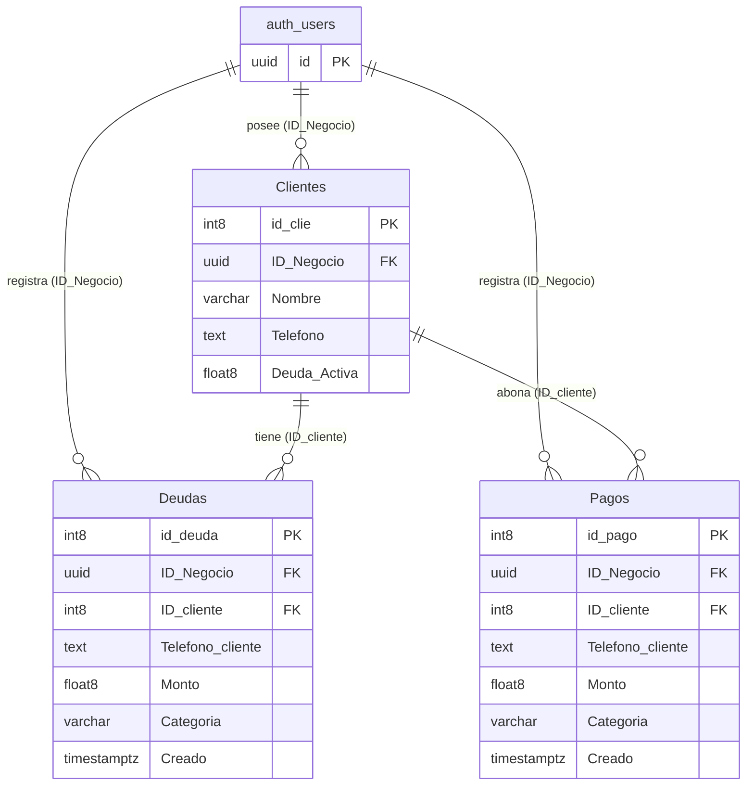

# Esquema de Base de Datos - DebiTu

Este documento registra la estructura de la base de datos (PostgreSQL / Supabase) del proyecto **DebiTu**, reflejando las relaciones y tipos de datos del sistema.

---

## 1. Entidad de Autenticación
### `auth.users` (Supabase Auth)
- **`id`** (`uuid`): Identificador único del usuario / negocio autenticado.

---

## 2. Tablas del Sistema

### Tabla: `Clientes`
Almacena la información de los clientes registrados por cada negocio.

| Columna | Tipo | Clave / Restricción | Descripción / Relación |
| :--- | :--- | :--- | :--- |
| `id_clie` | `int8` | **Primary Key** | Identificador único del cliente |
| `ID_Negocio` | `uuid` | **Foreign Key** | Vinculado a `auth.users.id` |
| `Nombre` | `varchar` | | Nombre o razón del cliente |
| `Telefono` | `text` | | Teléfono de contacto del cliente |
| `Deuda_Activa` | `float8` | | Saldo o total de deuda pendiente del cliente |

---

### Tabla: `Deudas`
Registra los cargos, deudas o créditos asignados a los clientes.

| Columna | Tipo | Clave / Restricción | Descripción / Relación |
| :--- | :--- | :--- | :--- |
| `id_deuda` | `int8` | **Primary Key** | Identificador único del registro de deuda |
| `ID_Negocio` | `uuid` | **Foreign Key** | Vinculado a `auth.users.id` |
| `ID_cliente` | `int8` | **Foreign Key** | Vinculado a `Clientes.id_clie` |
| `Telefono_cliente` | `text` | | Teléfono del cliente al momento de registrar |
| `Monto` | `float8` | | Importe de la deuda |
| `Categoria` | `varchar` | | Categoría o concepto de la deuda |
| `Creado` | `timestamptz` | | Fecha y hora de creación del registro |

---

### Tabla: `Pagos`
Registra los abonos o pagos realizados por los clientes.

| Columna | Tipo | Clave / Restricción | Descripción / Relación |
| :--- | :--- | :--- | :--- |
| `id_pago` | `int8` | **Primary Key** | Identificador único del abono/pago |
| `ID_Negocio` | `uuid` | **Foreign Key** | Vinculado a `auth.users.id` |
| `ID_cliente` | `int8` | **Foreign Key** | Vinculado a `Clientes.id_clie` |
| `Telefono_cliente` | `text` | | Teléfono del cliente al momento de registrar |
| `Monto` | `float8` | | Importe abonado/pagado |
| `Categoria` | `varchar` | | Categoría, método o concepto del pago |
| `Creado` | `timestamptz` | | Fecha y hora de creación del registro |

---

## 3. Diagrama de Relaciones (Mermaid)

